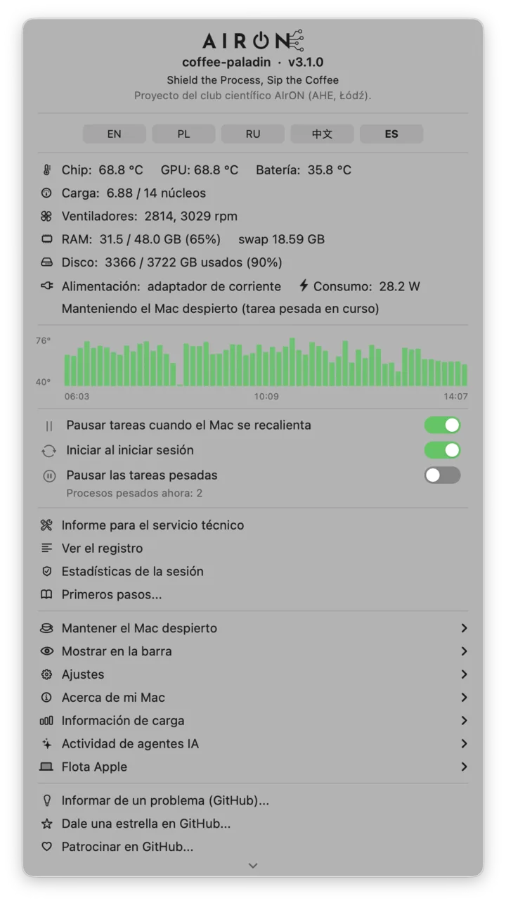
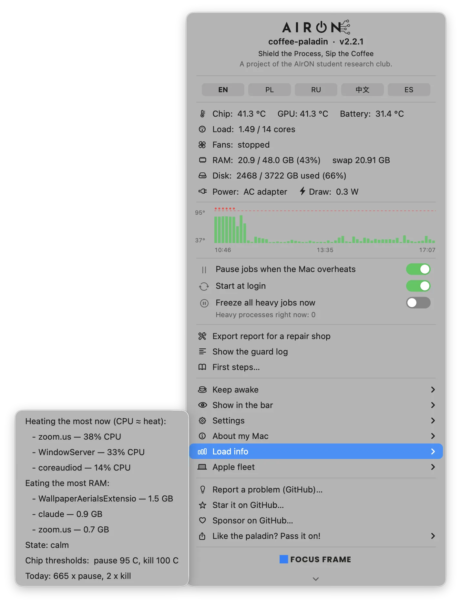
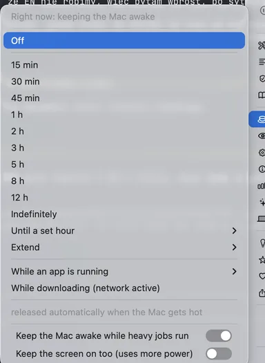
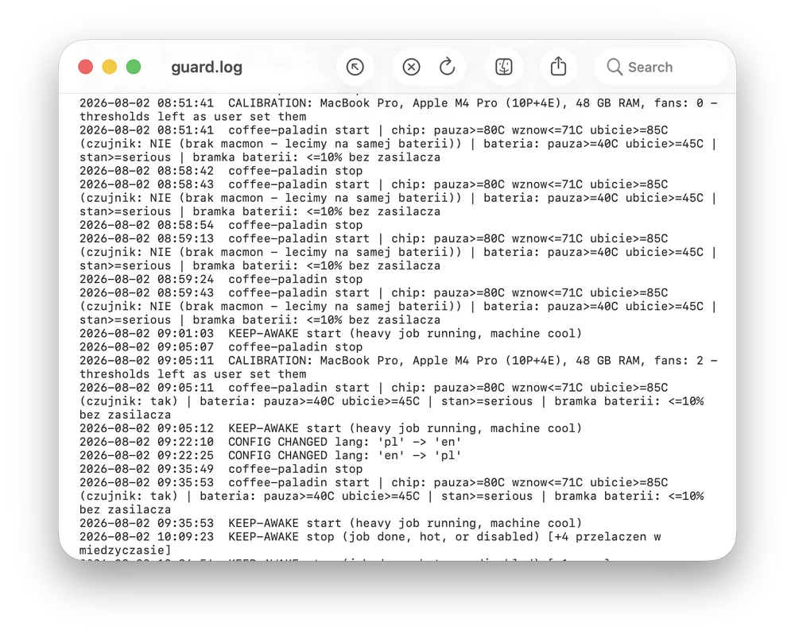
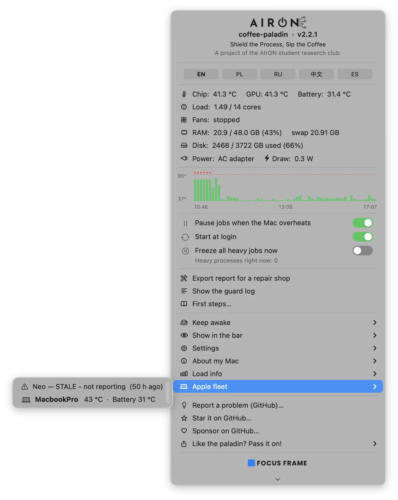

<p align="center">
  
</p>
<p align="center"><em>Shield the Process, Sip the Coffee</em></p>

# coffee-paladin (coffee-paladin) v1.9.0

**Un fusible térmico y de energía para Macs con Apple Silicon — de un solo portátil
a una flota entera.** Vigila la temperatura del chip, la batería, los ventiladores y la
fuente de alimentación, y **congela** los trabajos pesados antes de que la máquina se
cocine a sí misma, en lugar de dejarlos correr hasta el apagón.

Sin `sudo`. Sin extensiones de kernel. Sin demonios ejecutándose como root.
Todo se lee con un proceso de usuario normal.

> Esta es la versión resumida. La documentación completa — con mediciones, los fracasos
> documentados y el porqué de cada decisión — está en el [README en inglés](README.md).

<p align="center">
  
</p>

---

## Por qué existe

Un MacBook Pro M4 Pro trabajó toda la noche renderizando vídeo, exactamente para lo que
se compran estas máquinas. Por la mañana: olor a quemado bajo el chasis y un apagón forzado.
Y lo peor: al revisar los registros después **no había nada que revisar** — ni kernel panic,
ni registro de apagado térmico; el log del sistema simplemente terminaba en el instante
en que la máquina murió. No había forma de reconstruir la curva de temperatura.

Además, perder un Mac duele más en 2026 que nunca. Cuando llamamos a los operadores de
leasing en Polonia este julio, el plazo para un MacBook nuevo era de 15+ semanas, con
clientes en cola desde abril; hasta los M1 viejos se agotaban y los precios habían subido.

Este proyecto es la respuesta a ambas cosas: **pararlo antes de que se cocine** y
**conservar las pruebas** si aun así algo sale mal.

---

## Qué hace exactamente

**1. Pausa en lugar de matar.** Cuando el chip se calienta, los procesos pesados reciben
`SIGSTOP`: el proceso se congela donde está, su memoria queda intacta y, al enfriarse,
recibe `SIGCONT` y continúa desde el mismo punto. La parada ocurre entre instrucciones,
así que la pausa en sí no puede corromper los datos del proceso. Y no tiene nada de exótico:
macOS hace esto todo el día por su cuenta (App Nap con las apps en segundo plano, cualquier
depurador al engancharse) y el hardware no sufre desgaste. Medido en un trabajo real:
chip a 89,3 °C → pausa → **60,2 °C diecinueve segundos después** → reanudación.
El cálculo no se enteró.

**2. Encuentra al culpable de verdad.** Una lista de nombres conocidos siempre tiene agujeros:
un binario propio llamado `b3core` llevó la máquina a 90 °C porque no coincidía con nada.
Un caso peor: un script de Python lanzaba cientos de instancias del solver `cadical` que
vivían un segundo cada una — cada hijo demasiado breve para cruzar un umbral, el padre
casi sin CPU propia, y entre todos ocho núcleos al 100 %. Por eso el guard calcula el
**uso de CPU de todo el árbol de procesos**: aquel Python apareció como **595 %** y fue
congelado en el origen, lo que además cortó el nacimiento de nuevos hijos.

<p align="center">
  
</p>

**3. Vigila la energía, no solo el calor.** Con batería y por debajo del 10 %, los trabajos
largos se pausan y solo se reanudan al enchufar: un cálculo de treinta días no debería morir
a mitad de camino porque el portátil se quedó sin carga. Además, alarma de ventiladores:
chip por encima de 70 °C con ambos ventiladores a 0 rpm — un ventilador agarrotado es
precisamente una causa habitual de ese olor a quemado.

**4. Mantiene el Mac despierto — pero con fusible.** Temporizador (de 15 minutos a 12 horas),
indefinidamente, mientras se ejecuta una app concreta, mientras hay descargas: el juego
completo al estilo Amphetamine. La diferencia es el **fusible**: todos esos modos mantienen
el bloqueo de suspensión **solo mientras la máquina está fría**. En cuanto el guard empieza
a pausar por calor, el bloqueo se libera — dormir es la forma más rápida de enfriarse, y un
«no duermas» incondicional dentro de una mochila es exactamente como se cocinan los MacBook.

<p align="center">
  
</p>

**5. Se calibra a la máquina donde aterriza.** En el primer arranque mide qué Mac es —
si tiene ventiladores, cuántos núcleos, qué chip — y elige umbrales acordes. Las máquinas
sin ventilador reciben umbrales más bajos y una pausa máxima más larga.

**6. Guarda pruebas (la caja negra).** Escribe un pulso en cada ciclo y, tras reiniciar,
lo compara con la hora de arranque: si el último pulso es posterior al arranque, la máquina
se apagó en seco. Junto a eso queda el histórico de temperaturas. `thermal-report` lo
convierte todo en un documento que un servicio técnico aceptará.

<p align="center">
  
</p>

---

## En qué se diferencia de Caffeine / Amphetamine / Stats

| | Caffeine | Amphetamine | Stats / iStat | coffee-paladin |
|---|---|---|---|---|
| Muestra la temperatura | no | no | **sí** | **sí** |
| Mantiene el sistema despierto | vía pantalla | sí | no | **sí** |
| Deja que la pantalla duerma y se bloquee | no | según config. | — | **siempre** |
| Suelta el bloqueo cuando el Mac se calienta | no | no | — | **sí, fusible térmico** |
| Pausa los trabajos que recalientan el Mac | no | no | no | **sí** |
| Registra una caja negra antes del apagón | no | no | no | **sí** |
| Código abierto | no | no | parcial | **MIT** |

En una frase: Stats e iStat Menus son un **panel de instrumentos** — te dicen cuánto calienta.
Caffeine y Amphetamine son un **interruptor** — impiden que la máquina duerma.
coffee-paladin es un **fusible**: actúa por su cuenta.

---

## Flotas: todos los Macs en una tabla

Cada vez más empresas ejecutan IA local en Macs: Mac mini o Mac Studio con mucha RAM,
modelos on-premise, datos que no salen de la red. Esas máquinas trabajan 24/7, igual que
las granjas de render, los estudios de postproducción y los pools de CI. Cada máquina
escribe una instantánea en una carpeta compartida (iCloud, SMB, NFS — da igual) y en el
menú aparece una tabla: quién está caliente, quién ya está pausando trabajos y quién lleva
horas en silencio.

<p align="center">
  
</p>

---

## Tu agente de IA puede hablar con él

Los agentes de programación son hoy una fuente normal de carga en un portátil y, en la
práctica, la peor: un agente no oye el ventilador ni nota que la máquina se está calentando.
Por eso el proyecto incluye un **skill para agentes de IA**; `install.sh` lo coloca en
`~/.claude/skills/coffee-paladin/` (Claude Code lo detecta solo, y al ser Markdown plano
sirve para cualquier agente que lea skills).

Le enseña cuatro cosas: mirar antes de empezar leyendo `~/.coffee-paladin/status.json`
(el campo `level` lo decide todo: `0` adelante, `1` no paralelices, `2` no empieces nada
nuevo, `3` para y avisa a la persona); lanzar lo pesado con `safe-run`; **nunca** hacer
`SIGCONT` a un proceso que el guard congeló; y no generar calor de entrada — ninguna tarea
en segundo plano sin tiempo límite y limpieza, ninguna búsqueda recursiva en carpetas
sincronizadas con iCloud. Esta última regla salió de un incidente real: un `grep` que gastó
13 segundos de CPU en 1 h 42 min mantuvo un Mac sin ventilador a 90 °C, porque obligaba a
`fileproviderd` y `cloudd` a materializar archivos desde la nube.

---

## Instalación

**Con Homebrew (lo más simple):**

```bash
brew install pawelkwaczynski/tap/coffee-paladin
bash "$(brew --prefix)/share/coffee-paladin/install.sh"
```

Hacen falta las dos líneas: `brew install` solo deja los archivos, y la segunda compila
la app de la barra de menús y arranca el demonio.

**Desde el código fuente:**

```bash
git clone https://github.com/pawelkwaczynski/coffee-paladin.git
cd coffee-paladin
bash install.sh
```

El script compila las partes en Swift en la propia máquina, registra el LaunchAgent y
arranca la app de la barra de menús. **Empieza en modo de solo observación**: mide y avisa,
pero no toca nada. Cuando compruebes que ve cosas razonables, desmarca
*Ajustes → Solo observar* y la protección se activa. Se puede volver atrás cuando quieras,
sin reiniciar nada.

## Uso

```bash
heat                          # un comando: cuánto calienta y qué lo está calentando
safe-run -- ffmpeg -i in.mp4  # la forma correcta de lanzar un trabajo pesado
thermal-report                # informe para el servicio técnico
fleet --setup                 # configurar la carpeta compartida de la flota
heat --paladin                # huevo de pascua ☕︎
```

La barra de menús, las notificaciones y todas las herramientas hablan **cinco idiomas**:
inglés (por defecto), polaco, ruso, chino y español. Se cambia en *Ajustes → Idioma*.

## Limitaciones conocidas

- La pausa es visible para la **E/S sensible al tiempo**: el otro extremo de una conexión,
  los watchdogs y los servidores de licencias pueden notarla. La alternativa es peor de
  todos modos: el calor sin gestionar hace que macOS limite todo y, en el extremo,
  que la máquina se apague en seco.
- La temperatura del chip llega vía `macmon` (IOReport, sin sudo). Sin él el guard funciona,
  pero se apoya solo en la temperatura de la batería y el estado térmico del sistema,
  y reacciona varios minutos más tarde.
- Solo **Apple Silicon**. En los Macs Intel la ruta a los sensores es distinta
  (SMC en vez de IOReport) y todavía no está implementada.
- No sustituye a una reparación de la refrigeración. Si el ventilador está muerto, el guard
  solo pausará tus trabajos más a menudo — y lo dejará por escrito.

---

## Licencia y autoría

MIT. Haz lo que quieras con esto. Si te salva la máquina, con eso basta.

Autor: Paweł Kwaczyński / FOCUS FRAME, 2026. El proyecto se desarrolla también dentro de
**AIrON**, el club de investigación estudiantil de informática de la AHE en Łódź.
El código Swift lo escribió **Claude (Anthropic)** en Claude Code, con **Codex (OpenAI,
GPT-5.5)** como revisor adversarial y dos modelos locales en paralelo:
Devstral 24B sobre MLX y qwen3:4b sobre Ollama.

**Ilustración.** El paladín, la mascota, es un **diseño propio del autor** y se usa como
imagen oficial del proyecto; los detalles están en [`branding/CREDITS.md`](branding/CREDITS.md).

