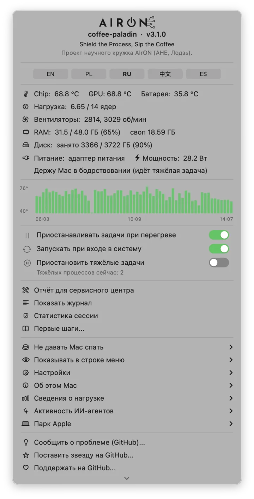

<p align="center">
  
</p>
<p align="center"><em>Shield the Process, Sip the Coffee</em></p>

# coffee-paladin

**Тепловой и энергетический предохранитель для Mac на Apple Silicon - от одного ноутбука
до целого парка машин.** Следит за температурой чипа, батареи, оборотами вентиляторов
и источником питания, и **замораживает** тяжёлые задачи прежде, чем машина сварит сама себя,
вместо того чтобы дать им работать до жёсткого выключения.

**Требования: Apple Silicon (M1 или новее) и macOS 14+.** Без `sudo`. Без расширений ядра.
Без демонов от root. Все датчики читаются обычным пользовательским процессом.

> Это краткая версия. Полная документация - с измерениями, разобранными провалами
> и обоснованием решений - в [английском README](README.md).

<p align="center">
  
</p>

---

## Откуда это взялось

MacBook Pro M4 Pro работал ночь напролёт - рендер видео и другие тяжёлые задачи, ровно то,
ради чего такие машины и покупают. Утром: запах гари из-под корпуса и жёсткое выключение.
Хуже того, когда потом полезли в логи, **смотреть оказалось не на что**: ни kernel panic,
ни записи о тепловом отключении, системный журнал просто обрывался в момент смерти машины.
Восстановить температурную кривую было нечем.

А потерять Mac в 2026 году больнее, чем когда-либо. В июле лизинговые операторы в Польше
называли срок ожидания новых MacBook 15+ недель, клиенты стояли в очереди с апреля,
даже стареющие M1 разбирали, а прайс вырос.

Этот проект - ответ на обе вещи: **остановить до того, как сварится**, и
**сохранить доказательства**, если всё-таки случится беда.

---

## Что он делает

**1. Приостанавливает, а не убивает.** При перегреве тяжёлые процессы получают `SIGSTOP`:
процесс замирает на месте, память нетронута, после охлаждения приходит `SIGCONT` и счёт
продолжается с той же точки. Остановка происходит между инструкциями, поэтому сама пауза
не может испортить данные процесса. И в этом нет ничего экзотического: macOS делает так
постоянно (App Nap с фоновыми приложениями, любой отладчик при подключении), износа
железа тоже нет. Замерено на живой задаче: чип 89,3 °C → пауза → **60,2 °C через
девятнадцать секунд** → возобновление. Вычисление ничего не заметило.

**2. Находит настоящего виновника.** Список известных имён процессов всегда дырявый:
собственный бинарник `b3core` разогнал машину до 90 °C, потому что ни под что не подходил.
Случай похуже: скрипт на Python порождал сотни экземпляров солвера `cadical`, живущих
по секунде - каждый ребёнок слишком короткий, чтобы перейти порог, сам родитель почти
не грузил CPU, а вместе они держали восемь ядер на 100 %. Поэтому guard считает
**загрузку всего дерева процессов**: тот Python показался как **595 %** и был заморожен
в источнике, что заодно прекратило порождение новых детей.

<p align="center">
  
</p>

**3. Смотрит не только на тепло, но и на питание.** На батарее при заряде ниже 10 %
длинные задачи ставятся на паузу и возобновляются только после подключения к сети:
тридцатидневный расчёт не должен умирать на полпути из-за разряженного ноутбука.
Плюс тревога по вентиляторам: чип выше 70 °C, а оба вентилятора показывают 0 об/мин -
заклинивший вентилятор как раз и даёт тот самый запах гари.

**4. Не даёт Mac уснуть - но с предохранителем.** Таймер (от 15 минут до 12 часов),
бессрочно, пока работает выбранное приложение, пока идёт загрузка - полный набор
в духе Amphetamine. Разница в **предохранителе**: любой из этих режимов держит блокировку
сна **только пока машина холодная**. Как только guard начинает тормозить задачи из-за
жары, блокировка снимается: сон - это самый быстрый способ охладиться, а безусловное
«не спать» в рюкзаке - ровно тот сценарий, в котором MacBook и варится.

<p align="center">
  
</p>

**5. Калибрует себя под машину - и знает её пределы.** При первом запуске измеряет,
что это за Mac (есть ли вентиляторы, сколько ядер, какой чип) и выбирает пороги под него.
Безвентиляторные машины получают более низкие пороги и более длинную допустимую паузу;
пороги, выставленные вручную, никогда не перезаписываются. А накопив историю, `heat --profile` читает измерения именно этой машины и говорит,
где её реальные границы: температура простоя, плато под длительной нагрузкой, температура
старта вентиляторов, приходилось ли macOS придерживать CPU. Если пороги не подходят
машине, он говорит об этом и печатает подходящие - но **сам никогда ничего не записывает**,
а у советов есть перила: порог убийства никогда не повышается, порог возобновления
никогда не попадает в полосу простоя, мало данных - нет совета.

**6. Умеет выстраивать тяжёлые задачи в очередь (опционально).** С включённым
`admission_control` задачи, запущенные через `safe-run`, объявляют число ядер
(`--cores 6`), и guard впускает их или ставит в очередь по тепловому запасу: холодный
чип - полный пул P-ядер, тёплый - половина, горячий - никого нового. Очередь переживает
перезапуск демона, `--after ИМЯ` строит цепочки без ручных циклов с `pgrep`. Арбитр
только задерживает старты: он никогда ничего не приостанавливает и не убивает, а при
любой внутренней ошибке впускает всех. По умолчанию выключено.

**7. Хранит доказательства (чёрный ящик).** Каждый цикл демон пишет пульс, а при чистом
завершении - отдельную метку. После перезагрузки он сравнивает и то и другое с временем
старта системы: пульс, оборвавшийся до загрузки, без метки чистого завершения - значит,
машина погасла без предупреждения. Событие записывается **вместе с восемью последними
измерениями перед падением**. `thermal-report` собирает из этого один документ, который
примут в сервисе: железо и серийный номер, здоровье батареи, жёсткие выключения с
показаниями перед ними, все вмешательства guard-а и полную историю температур.

<p align="center">
  
</p>

---

## Чем это отличается от Caffeine / Amphetamine / Stats

| | Caffeine | Amphetamine | Stats / iStat | coffee-paladin |
|---|---|---|---|---|
| Показывает температуру | нет | нет | **да** | **да** |
| Держит систему бодрствующей | через экран | да | нет | **да** |
| Позволяет экрану гаснуть и блокироваться | нет | зависит от настроек | - | **всегда** |
| Снимает блокировку, когда машина греется | нет | нет | - | **да, предохранитель** |
| Ставит на паузу задачи, перегревающие Mac | нет | нет | нет | **да** |
| Пишет чёрный ящик перед жёстким выключением | нет | нет | нет | **да** |
| Открытый код | нет | нет | частично | **MIT** |

Коротко: Stats и iStat Menus - это **приборная панель**, они показывают, как горячо.
Caffeine и Amphetamine - это **выключатель**, они не дают машине уснуть.
coffee-paladin - это **предохранитель**: он вмешивается сам.

---

## Парк машин: все Mac в одной таблице

Компании всё чаще держат локальный AI на Mac: Mac mini или Mac Studio с большой памятью,
модели on-prem, данные не уходят в облако. Такие машины молотят 24/7 - как и рендер-фермы,
студии постпродакшена и пулы CI. Каждая машина пишет снимок состояния в общий каталог
(iCloud, SMB, NFS - что угодно), и в меню появляется таблица: кто греется, кто уже
приостанавливает задачи, а кто перестал отчитываться (метка STALE появляется
после пяти минут тишины).

<p align="center">
  
</p>

---

## Ваш AI-агент умеет с ним разговаривать

Кодовые агенты сегодня - обычный источник нагрузки на ноутбук, и на практике худший:
агент не слышит вентилятор и не замечает, что машина раскаляется. Поэтому проект везёт
с собой **skill для AI-агентов**; `install.sh` кладёт его в
`~/.claude/skills/coffee-paladin/` (Claude Code подхватывает сам, это обычный Markdown,
так что подойдёт любому агенту, который читает скиллы).

Он учит четырём вещам: сначала прочитать `~/.coffee-paladin/status.json`
(решает поле `level`: `0` запускай, `1` не распараллеливай, `2` не начинай нового,
`3` остановись и скажи человеку); тяжёлое запускать через `safe-run`; **никогда**
не делать `SIGCONT` процессу, который guard заморозил; и не создавать жару без нужды -
никаких фоновых задач без таймаута и уборки, никакого рекурсивного поиска по каталогам,
синхронизируемым с iCloud. Последнее правило родилось из реального случая: `grep`,
израсходовавший 13 секунд процессора за 1 ч 42 мин, держал безвентиляторный Mac на 90 °C,
потому что заставлял `fileproviderd` и `cloudd` тянуть файлы из облака.

**Строка статуса в Claude Code.** Установщик умеет вписать тепловое состояние
прямо под сессию агента: `🛡  🌡 55°  🌀 2.4k  🧠 50%  💾 94%  ☕`. Щит превращается
в глаз в режиме наблюдения и в громкое красное `OFF`, когда снимок демона
устаревает - ровно та авария, в которой страж выключен и никто не замечает.
Чужую строку статуса установщик никогда не трогает (`--replace` - осознанный
выбор человека), а деинсталлятор убирает только собственную запись.

**Активность агентов.** Демон пишет `agent_activity.json`: какие сессии AI
работают на этом Mac и какое дерево процессов каждая запустила, с тепловым
контекстом. В меню есть подменю с иконками по типу процесса, а на панели
значок ✨ горит, пока жива хоть одна сессия - само присутствие значка отвечает
на вопрос «работает ли сейчас AI». Панель при этом стала тише: постоянно видны
только чип и RAM, остальное (вентиляторы, батарея от 40 °C, значок AI, пауза)
появляется лишь когда несёт новость, с гистерезисом 60 секунд.

**Одни ворота для всех хостов агентов.** `coffee-paladin hook-gate` реализует
общий контракт pre-exec хуков, который делят Claude Code, Codex CLI, Gemini CLI
и Grok Build (JSON на stdin, выход 2 = блокировка): тяжёлый инструмент,
запущенный голым - `ffmpeg`, солвер, `ollama run` - получает отказ с готовой
строкой `safe-run` вместо этого. Ворота проверяют дисциплину процесса, не
температуру, отвечают за миллисекунды и открыты при любой ошибке.

**Пульс прогресса.** `safe-run` даёт задаче путь к файлу в `$PALADIN_PROGRESS`;
задача касается его после каждой законченной единицы работы, а объявив свой
ритм (`--progress-interval 300`), получает честное «возможно, стоит» в `status`
и уведомлением - всегда словами, никогда сигналом.

---

## Установка

**Через Homebrew (проще всего):**

```bash
brew install pawelkwaczynski/tap/coffee-paladin
bash "$(brew --prefix)/share/coffee-paladin/install.sh"
```

Нужны обе строки: `brew install` только кладёт файлы, а вторая собирает приложение
в строке меню и запускает демона.

Если Mac переезжал Ассистентом миграции с Intel-машины, в `/usr/local` может жить
второй, Intel-овский Homebrew, и голая команда `brew` может указывать именно на него -
а он не знает этот tap. Тогда используйте полные пути: `/opt/homebrew/bin/brew install ...`.
Подробности в [FAQ](FAQ.md).

**Из исходников:**

```bash
git clone https://github.com/pawelkwaczynski/coffee-paladin.git
cd coffee-paladin
bash install.sh
```

Оба пути дают одну и ту же версию.

Скрипт собирает Swift-части прямо на машине и ставит **два** LaunchAgent-а: демона и,
отдельно, приложение строки меню - его можно отключить, не трогая защиту.
**Стартует в режиме наблюдения**: измеряет и предупреждает, но ничего не трогает.
Когда убедитесь, что видит он разумные вещи, включите защиту одним кликом в меню
(*Включить защиту*) либо снимите галочку *Настройки → Только наблюдение (dry run)*.
Вернуть обратно можно в любой момент, перезапуск не нужен.

Удаление: пункт **«Удалить»** прямо в меню (с галочкой «удалить и данные» и вторым
окном-предупреждением) или `bash uninstall.sh`. История измерений и чёрный ящик
по умолчанию остаются - они ещё могут пригодиться для гарантии; `--purge` удаляет и их.

## Использование

```bash
heat                            # одна команда: насколько горячо и что греет
heat --profile                  # тепловой профиль ЭТОЙ машины из её собственной истории
safe-run --hours 8 -- ffmpeg …  # правильный способ запустить тяжёлую задачу
thermal-report --days 14        # отчёт для сервисного центра (--pdf даст PDF)
fleet --setup                   # настройка общего каталога парка
heat --paladin                  # пасхалка ☕︎
```

У `safe-run` есть флаги на длинные ночные очереди: `--wait-cool` (на горячей машине
подождать остывания и стартовать, вместо отказа кодом ошибки), `--grace N` (секунды
между `SIGTERM` и `SIGKILL`, чтобы солвер или кодировщик успел записать состояние),
а при выходе он прибирает всю группу процессов - осиротевший ребёнок больше не может
пережить своего супервизора и греть машину часами без лимита времени.

**Строка меню и «чёлка».** Полный набор показаний не помещается рядом с чёлкой
MacBook Pro, и macOS в этом случае вообще не рисует элемент - молча. Поэтому свежая
установка держит постоянно только чип и RAM (остальное - условно, когда несёт
новость), в меню есть три пресета
(«Только значок», «Значок и температура чипа», «Показать всё»), а те же пресеты доступны
из терминала - на случай, когда иконки не видно и меню нечем открыть:

```bash
coffee-paladin bar icon-only   # только термометр, помещается везде
coffee-paladin bar chip        # иконка и одно число
coffee-paladin bar full        # всё
coffee-paladin panel           # открыть окно в обход строки меню
```

Обновление сохраняет раскладку, которую вы уже выбрали.

Строка меню, уведомления и все утилиты говорят на **пяти языках**: английском (по умолчанию),
польском, русском, китайском и испанском. Кнопки переключения - прямо в главном меню.

## Известные ограничения

- Пауза заметна для **чувствительного ко времени ввода-вывода**: сетевой партнёр,
  watchdog или сервер лицензий могут её увидеть. Альтернатива всё равно хуже:
  неуправляемое тепло означает троттлинг всего, а в пределе - жёсткое выключение.
- Температура чипа берётся через `macmon` (IOReport, без sudo). Без него guard работает,
  но опирается только на температуру батареи и тепловое состояние системы,
  а значит реагирует на несколько минут позже.
- Только **Apple Silicon** и **macOS 14 или новее**. На Intel-маках путь к датчикам
  совсем другой (SMC вместо IOReport), и он пока не реализован.
- Это не замена ремонту охлаждения. Если вентилятор умер, guard просто будет чаще
  ставить ваши задачи на паузу - и запишет это.

---

## Лицензия и авторство

MIT. Делайте что хотите. Если он спас вашу машину - этого достаточно.

Автор: Paweł Kwaczyński / FOCUS FRAME, 2026. Проект также развивается в рамках
студенческого научного кружка **AIrON** (информатика, AHE, Лодзь).
Swift написал **Claude (Anthropic)** в Claude Code, роль состязательного рецензента
играл **Codex (OpenAI, GPT-5.5)**, параллельно работали две локальные модели -
Devstral 24B на MLX и qwen3:4b на Ollama.

**Графика.** Паладин-маскот выполнен по **собственному дизайну автора** и используется как
официальный образ проекта; подробности в [`branding/CREDITS.md`](branding/CREDITS.md).
