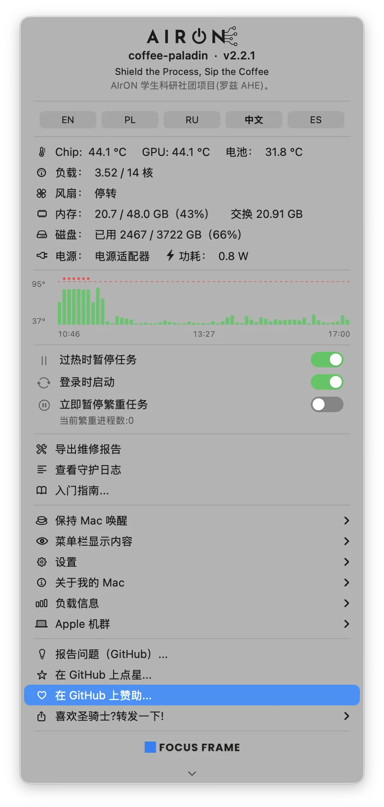

<p align="center">
  
</p>
<p align="center"><em>Shield the Process, Sip the Coffee</em></p>

# coffee-paladin（coffee-paladin）v1.9.0

**为 Apple Silicon Mac 打造的过热与电源保险丝 —— 从一台笔记本到整个机群。**
它监测芯片温度、电池、风扇和供电状态，在机器把自己烤坏之前**冻结**繁重任务，
而不是任由它们跑到强制关机。

不需要 `sudo`，不需要内核扩展，没有以 root 身份运行的守护进程。
所有传感器数据都由普通用户进程读取。

> 这是精简版。完整文档（含测量数据、失败案例和设计取舍）见
> [英文 README](README.md)。

<p align="center">
  
</p>

---

## 为什么会有这个项目

一台 MacBook Pro M4 Pro 通宵渲染视频。早上：机身下方传出焦味，机器硬关机。
更糟的是事后翻日志时**没有任何东西可查**——没有内核崩溃记录，没有过热关机记录，
系统日志就在机器死掉的那一刻断掉了。温度曲线无从还原。

而在 2026 年丢一台 Mac 比以往任何时候都疼。今年七月我们询价时，
波兰租赁商给出的新 MacBook 等货期是 15 周以上，连老款 M1 都在售罄，标价还涨了。

这个项目就是对这两件事的回答：**在烤坏之前拦住它**，以及**万一出事，留下证据**。

---

## 它到底做什么

**1. 暂停，而不是杀死。** 芯片过热时，繁重进程收到 `SIGSTOP`：进程原地冻结，
内存不动，降温后收到 `SIGCONT` 从断点继续。暂停发生在两条指令之间，
因此不会损坏进程数据。这也不是什么奇技淫巧——macOS 自己整天这么干
（App Nap 对后台应用就这么做，每个调试器附加时都这么做），硬件也没有损耗。
实测：芯片 89.3 °C → 暂停 → **19 秒后 60.2 °C** → 恢复，计算毫无察觉。

**2. 找出真正的元凶。** 只按名字匹配的白名单永远有漏洞：一个自编译的 `b3core`
把机器推到 90 °C，因为它不在任何名单上。更隐蔽的情况：一个 Python 脚本
每秒派生上百个只活一秒的 `cadical` 求解器——每个子进程都短到跨不过阈值，
父进程自己几乎不占 CPU，合起来却把八个核心跑满。所以 guard 计算的是
**整棵进程子树的 CPU 占用**，那个 Python 进程显示为 **595%**，并在源头冻结它。

<p align="center">
  
</p>

**3. 不只看温度，也看电源。** 用电池且电量降到 10% 时暂停长任务，插上电源才恢复——
一个跑 30 天的计算不该因为笔记本没电而半途夭折。另外：芯片超过 70 °C 而两个风扇
都报告 0 rpm 时发出告警，风扇卡死正是上面那股焦味的常见成因。

**4. 让 Mac 保持唤醒——但带保险丝。** 计时器（15 分钟到 12 小时）、无限期、
某个应用运行期间、下载期间——和 Amphetamine 一样齐全。区别在于**保险丝**：
所有模式**只在机器凉快时**持有唤醒锁。一旦 guard 因过热开始暂停任务，锁立即释放，
因为睡眠是最快的散热手段。背包里无条件保持唤醒，正是 MacBook 被烤坏的典型方式。

<p align="center">
  
</p>

**5. 自我校准。** 首次运行时测量这台机器的实际情况——有没有风扇、多少核心、
芯片型号——并据此选择阈值。无风扇的 Mac 得到更低的阈值和更长的允许暂停时间。

**6. 留下证据（黑匣子）。** 每个周期写一次心跳，重启后与开机时间比对；
如果上次心跳晚于本次开机，说明机器是硬关机的。历史温度曲线一并保存。
`thermal-report` 把这些整理成维修店能接受的一份文件。

<p align="center">
  
</p>

---

## 和 Caffeine / Amphetamine / Stats 有什么不同

| | Caffeine | Amphetamine | Stats / iStat | coffee-paladin |
|---|---|---|---|---|
| 显示温度 | 否 | 否 | **是** | **是** |
| 保持系统唤醒 | 借助屏幕 | 是 | 否 | **是** |
| 允许屏幕休眠并锁屏 | 否 | 视设置而定 | — | **总是** |
| 机器过热时释放唤醒锁 | 否 | 否 | — | **是（热保险丝）** |
| 暂停让 Mac 过热的任务 | 否 | 否 | 否 | **是** |
| 硬关机前记录黑匣子 | 否 | 否 | 否 | **是** |
| 开源 | 否 | 否 | 部分 | **MIT** |

一句话：Stats 和 iStat Menus 是**仪表盘**——它们告诉你机器有多热。
Caffeine 和 Amphetamine 是**开关**——它们让机器别睡。
coffee-paladin 是**保险丝**——它会自己动手。

---

## 机群：所有 Mac 在同一张表里

越来越多公司把本地 AI 跑在 Mac 上：大内存的 Mac mini 或 Mac Studio，本地模型，
数据不出内网。这些机器 24/7 连轴转，渲染农场、后期工作室和 CI 池也一样。
每台机器把快照写进一个共享目录（iCloud、SMB、NFS 都行），菜单里就出现一张表：
谁热、谁在暂停任务、谁已经沉默了几个小时。

<p align="center">
  
</p>

---

## 你的 AI 助手也能和它对话

编码助手如今是笔记本上正常的负载来源，而且往往是最糟糕的那个——因为助手听不见风扇，
也感觉不到机器在发烫。所以本项目附带一份**给 AI 助手的 skill**，
`install.sh` 会把它放进 `~/.claude/skills/coffee-paladin/`（Claude Code 会自动读取；
它是纯 Markdown，任何能读 skill 的助手都能用）。

它教助手四件事：动手前先读 `~/.coffee-paladin/status.json`（`level` 字段说了算：
`0` 开工、`1` 别并行、`2` 别开新的、`3` 停下并告诉人类）；繁重任务通过 `safe-run` 启动；
**绝不**对 guard 冻结的进程发 `SIGCONT`；以及首先就别制造热量——后台任务必须有超时和清理，
不要递归搜索 iCloud 同步目录。最后这条来自一次真实事故：一个 `grep`
在 1 小时 42 分钟里只用了 13 秒 CPU，却让一台无风扇 Mac 稳在 90 °C，
因为它一直逼着 `fileproviderd` 和 `cloudd` 从云端拉取文件。

---

## 安装

```bash
git clone https://github.com/pawelkwaczynski/coffee-paladin.git
cd coffee-paladin
bash install.sh
```

安装脚本会在本机编译 Swift 部分、注册 LaunchAgent、启动菜单栏应用。
**默认以“仅观察”模式启动**：只测量和告警，不碰任何进程。
确认它看到的东西合理之后，在*设置 → 仅观察*里取消勾选即可开启保护，
随时可以再勾回去，无需重启。

## 使用

```bash
heat                          # 一条命令看清现在有多热、什么在发热
safe-run -- ffmpeg -i in.mp4  # 在监管下启动繁重任务（推荐方式）
thermal-report                # 生成给维修店的报告
fleet --setup                 # 配置机群共享目录
heat --paladin                # 彩蛋 ☕︎
```

菜单栏、通知和所有命令行工具支持**五种语言**：英语（默认）、波兰语、俄语、中文、西班牙语。
在*设置 → 语言*里一键切换。

## 已知限制

- 暂停对**时间敏感的 I/O** 是可见的：网络对端、看门狗和许可证服务器可能会注意到。
  但不管温度的代价更大——macOS 会全面降频，极端情况下机器硬关机。
- 芯片温度依赖 `macmon`（通过 IOReport 读取，无需 sudo）。没有它，guard 仍然工作，
  但只能依据电池温度和系统热压力，反应会慢几分钟。
- 只支持 **Apple Silicon**。Intel Mac 的传感器路径完全不同（SMC 而非 IOReport），
  尚未实现。
- 它不是替代散热维修的东西。如果风扇坏了，它只会更频繁地暂停你的任务，并把这件事记下来。

---

## 许可与署名

MIT。随便用。如果它救了你的机器，那就够了。

作者：Paweł Kwaczyński / FOCUS FRAME，2026。本项目同时是罗兹 AHE
计算机科学学生科研社团 **AIrON** 的项目。
Swift 部分由 **Claude（Anthropic）** 在 Claude Code 中编写，
**Codex（OpenAI，GPT-5.5）** 担任对抗性评审，另有两个本地模型
（MLX 上的 Devstral 24B 与 Ollama 上的 qwen3:4b）参与复核。

**美术。** 圣骑士吉祥物由 **ChatGPT（OpenAI）生成**，作为本项目的官方形象使用；
细节见 [`branding/CREDITS.md`](branding/CREDITS.md)。

